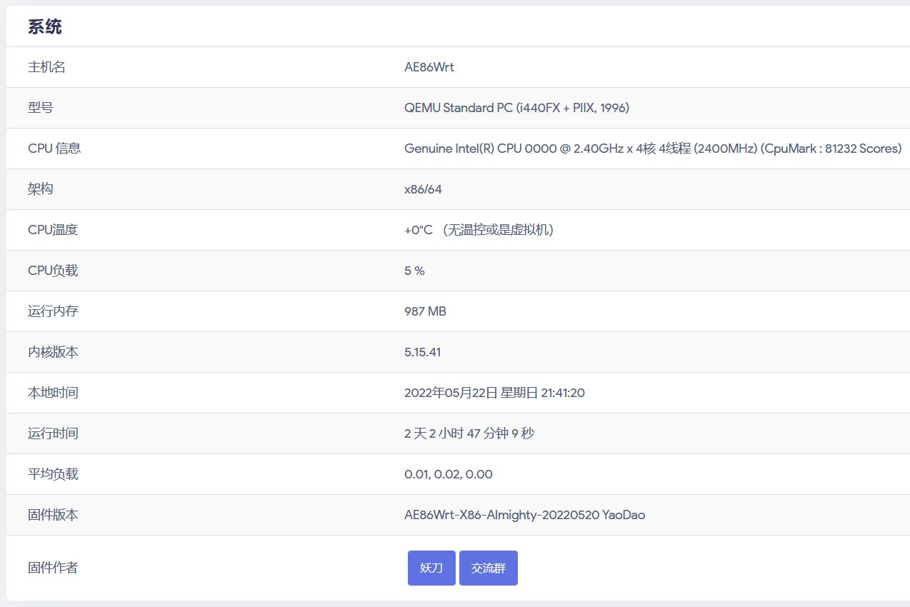

#### autocore

* 此项目仅适用于Lean的[LEDE](https://github.com/coolsnowwolf/lede)，且加入本人的定制信息，故不建议直接使用。

* (默认)添加了额外在x86在PVE的温度显示 teaminfo_pve 脚本文件，命令参考了pushbot。

* 无我个人定制信息的版本，可参考：[autocore-diy](https://github.com/xiangfeidexiaohuo/autocore-diy)

* 原项目为[myautocore](https://github.com/sirpdboy/myautocore)，可自行参考修改。

